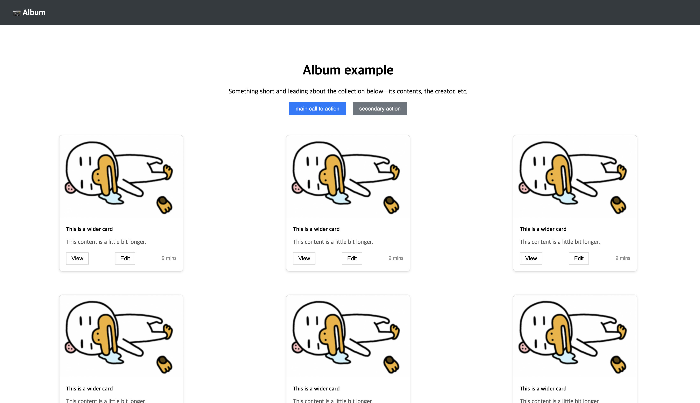

# 멋쟁이사자처럼 13기 클론코딩 과제

## 구현 화면
> 아래 이미지는 직접 구현한 결과입니다.



---

## 구현 사항

- [x] `components`, `assets`, `pages` 폴더 구분
- [x] 상단 `Header`는 스크롤해도 고정됨
- [x] 카드 9개 생성, 3개씩 정렬
- [x] 하단 `Footer` 포함..

---

## 컴포넌트 계층 구조

```txt
App.jsx
├── Header (상단 고정 내비게이션바)
├── AlbumPage
│   ├── PhotoCard x9 (반복 렌더링용 컴포넌트)
│   └── 소개문 + 버튼
└── Footer (하단 고정 푸터)

---

## 컴포넌트 계층 구조 및 설계 의도

### Header 컴포넌트

* 상단에 고정되는 네비게이션 바 역할.
* `<header>` 태그 내부에 좌측 로고(📷)와 우측 햄버거 아이콘을 배치.
* 정렬 목적으로 `display: flex`, `justify-content: space-between`, `align-items: center` 사용.
* 화면 상단에 고정되도록 `position: fixed`, `width: 100vw`, `z-index` 설정.

---

### Footer 컴포넌트

* 페이지 맨 아래 고정되는 바.
* 가운데 정렬된 간단한 텍스트가 들어감.
* 배경색이 상단과 이어지도록 `width: 100vw`, `background-color` 통일.


---

###  PhotoCard 컴포넌트

* 앨범의 핵심 UI 요소.
* 이미지 + 텍스트 + 버튼 2개로 구성.
* props(title, image, text, time)를 받아 각각 렌더링.
* 카드 간 간격을 유지하기 위해 부모에서 `grid` 사용.
* 카드 내부 정렬 및 스타일링을 위해 `flex-direction: column`, `gap` 활용.

------------- 
